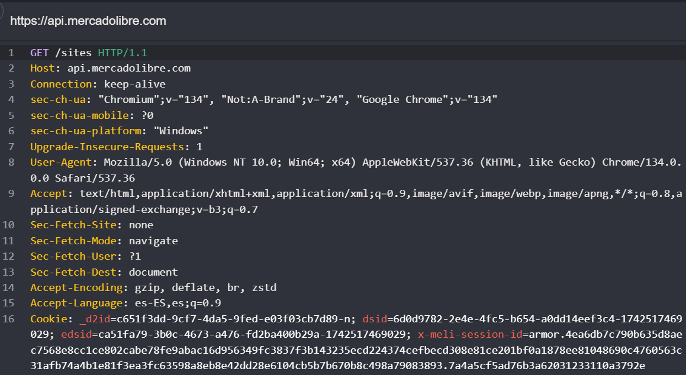

## Querying sites (no API TOKEN or credentials required)

```
https://api.mercadolibre.com/sites
```
- Request



- Response

```
HTTP/1.1 200 OK
Content-Type: application/json; charset=utf-8
Connection: keep-alive
Date: Fri, 21 Mar 2025 13:44:32 GMT
Access-Control-Allow-Methods: PUT, GET, POST, DELETE, OPTIONS
Access-Control-Max-Age: 86400
cache-control: max-age=86400,stale-while-revalidate=43200, stale-if-error=172800
X-Content-Type-Options: nosniff
X-Request-Id: 2f46188d-f06f-44fe-b877-60a6e96e8eef
Strict-Transport-Security: max-age=15552000; includeSubDomains;
X-Frame-Options: DENY
X-XSS-Protection: 1; mode=block
Access-Control-Allow-Origin: *
Access-Control-Allow-Headers: Content-Type
vary: accept-encoding
X-Cache: Miss from cloudfront
Via: 1.1 5dd9fbf58461632885f14b50f0c108a6.cloudfront.net (CloudFront)
X-Amz-Cf-Pop: ORD56-P10
X-Amz-Cf-Id: hyqHXjvWseTc_Kzm6SlpbWzB0qXlS201vIOcO-Pm0APVupUHhPaovw==
Content-Length: 1115

[{
    "default_currency_id": "HNL",
    "id": "MHN",
    "name": "Honduras"
}, {
    "default_currency_id": "GTQ",
    "id": "MGT",
    "name": "Guatemala"
}, {
    "default_currency_id": "ARS",
    "id": "MLA",
    "name": "Argentina"
}, {
    "default_currency_id": "COP",
    "id": "MCO",
    "name": "Colombia"
}, {
    "default_currency_id": "MXN",
    "id": "MLM",
    "name": "Mexico"
}, {
    "default_currency_id": "DOP",
    "id": "MRD",
    "name": "Dominicana"
}, {
    "default_currency_id": "USD",
    "id": "MSV",
    "name": "El Salvador"
}, {
    "default_currency_id": "CUP",
    "id": "MCU",
    "name": "Cuba"
}, {
    "default_currency_id": "PYG",
    "id": "MPY",
    "name": "Paraguay"
}, {
    "default_currency_id": "CRC",
    "id": "MCR",
    "name": "Costa Rica"
}, {
    "default_currency_id": "VES",
    "id": "MLV",
    "name": "Venezuela"
}, {
    "default_currency_id": "BRL",
    "id": "MLB",
    "name": "Brasil"
}, {
    "default_currency_id": "PEN",
    "id": "MPE",
    "name": "Perú"
}, {
    "default_currency_id": "BOB",
    "id": "MBO",
    "name": "Bolivia"
}, {
    "default_currency_id": "CLP",
    "id": "MLC",
    "name": "Chile"
}, {
    "default_currency_id": "USD",
    "id": "MEC",
    "name": "Ecuador"
}, {
    "default_currency_id": "UYU",
    "id": "MLU",
    "name": "Uruguay"
}, {
    "default_currency_id": "NIO",
    "id": "MNI",
    "name": "Nicaragua"
}, {
    "default_currency_id": "PAB",
    "id": "MPA",
    "name": "Panamá"
}]
```