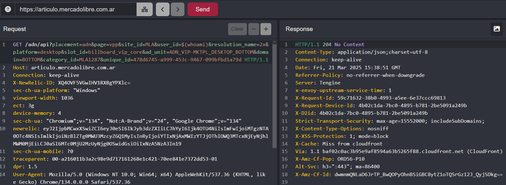

## We chose a random post from the site to test whether its parameters are vulnerable to RCE.

```
https://articulo.mercadolibre.com.ar
```
- We tried to inject an operating system command into the "user_id" parameter and got error 204


- We try again with the "$(whoami)" parameter but it still gives the same response.



